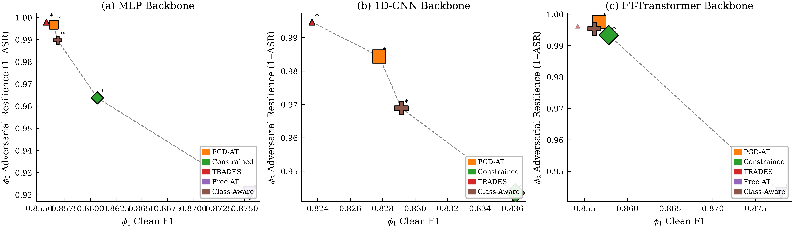

# A Backbone-Conditioned Pareto Analysis Framework for Preference-Aware IDS Defense Selection

**English** | [简体中文](README.zh-CN.md)

[](https://www.python.org/)
[](https://pytorch.org/)
[](https://docs.astral.sh/uv/)
[](LICENSE)
[](tests/)

Reference implementation and evaluation code for the paper:

> **A Backbone-Conditioned Pareto Analysis Framework for Preference-Aware IDS Defense Selection**  
> Xiyuan Huang, Na Zhao, Yi Zheng, Xin Su, Shuang Zhao, Qingquan Liao, Yu Tong  
> *Big Data and Cognitive Computing*, 2026

The framework treats adversarial IDS defense selection as a **multi-objective decision problem**:
every candidate defense is described by a four-dimensional profile, dominated candidates are
removed by Pareto filtering, unsafe candidates are screened by admissibility floors, and a
deployment-specific recommendation follows from a preference vector. The study covers three
backbones (MLP, 1D-CNN, FT-Transformer), six defenses, ten seeds, four attack families with four
perturbation budgets, and an adaptive attack suite.

```mermaid
flowchart LR
    A["UNSW-NB15 official split<br/>175,341 train / 82,332 test"] --> B["Feature pipeline<br/>39 continuous + 155 one-hot"]
    B --> C["Three backbones<br/>MLP / 1D-CNN / FT-Transformer"]
    C --> D["Six defenses<br/>Standard, PGD-AT, Constrained, TRADES, Free AT, Class-Aware"]
    D --> E["Constrained attacks<br/>FGSM, PGD, C&W, APGD, adaptive suite"]
    E --> F["Four objectives<br/>clean F1, resilience, cost efficiency, worst-class recall"]
    F --> G["Pareto filtering<br/>uncertainty-aware dominance, Eq. (2)-(4)"]
    G --> H["Admissibility floors<br/>resilience >= tau2, worst-class recall >= tau4"]
    H --> I["Preference-aware recommendation<br/>Robust / Balanced / Clean / Cost"]
```



---

## Key results

All numbers below come from the **revision protocol**: the official UNSW-NB15 split
(175,341 training / 82,332 testing records), ten random seeds, and PGD evaluated with
step size epsilon/10 for 50 iterations. The reference scenario is PGD at epsilon = 0.10.
Full tables and the exact regeneration commands are in [docs/results.md](docs/results.md).

**Attack success rate (%) under PGD at epsilon = 0.10 - lower is better**

| Defense | MLP | 1D-CNN | FT-Transformer |
|---|---:|---:|---:|
| Standard (undefended) | 15.82 | 19.03 | 10.79 |
| PGD-AT | 0.33 | 1.56 | **0.25** |
| Constrained AT | 3.63 | 5.65 | 0.66 |
| TRADES | **0.21** | **0.53** | 0.38 |
| Free AT | 7.91 | 10.29 | 5.69 |
| Class-Aware AT | 1.03 | 3.11 | 0.46 |

**Which defense is recommended depends on the backbone and on the deployment preference.**
Selection uses the uncertainty-aware Pareto front (mean +/- 1 std) with admissibility floors
tau2 = 0.90 (resilience) and tau4 = 0.60 (worst-class recall), so the undefended baseline can no
longer be recommended:

| Preference preset (phi1, phi2, phi3, phi4) | MLP | 1D-CNN | FT-Transformer |
|---|---|---|---|
| Robust (0.10, 0.60, 0.10, 0.20) | PGD-AT | TRADES | PGD-AT |
| Balanced (0.25, 0.35, 0.20, 0.20) | PGD-AT | PGD-AT | PGD-AT |
| Clean (0.50, 0.15, 0.15, 0.20) | Free AT | Constrained | Free AT |
| Cost (0.20, 0.20, 0.50, 0.10) | Free AT | PGD-AT | Constrained |



*Four-dimensional profiles projected onto (clean F1, resilience); starred markers are
Pareto-front candidates. Generated by `scripts/pareto_selection.py`.*

What the revision adds beyond the submitted manuscript:

- **Official split, ten seeds.** Every configuration is repeated over ten seeds and reported as
  mean +/- standard deviation, with paired tests, Holm/BH correction, effect sizes and bootstrap
  confidence intervals.
- **Uncertainty-aware Pareto.** The interval dominance rule of Eq. (4) keeps all six candidates
  on each backbone, whereas the point-estimate front excludes TRADES on the FT-Transformer
  (the submitted 6 -> 5 -> 4 contraction does not survive). After the admissibility floors, the
  admissible fronts contain 5 / 4 / 5 candidates.
- **Sensitivity and robustness analyses.** Preference-simplex sweep with exact switching
  hyperplanes, admissibility threshold sweep, leave-one-out candidate perturbation, TOPSIS and
  fixed-[0, 1] normalization comparators, bootstrap front-membership probabilities, and
  mean-versus-median aggregation.
- **Weighted-sum limitations.** The constrained PGD-AT on the MLP and TRADES on the
  FT-Transformer are *unsupported* Pareto points: no non-negative preference vector reaches them
  under the weighted sum. Both become reachable under an augmented weighted Tchebycheff rule with
  augmentation coefficient 0.1.
- **Attack and dataset evidence.** Adaptive attacks (restart PGD, gradient-free NES, complement
  attacks) show no gradient masking; cross-backbone transfer attacks reach at most 0.4% ASR
  between adversarially trained models; a CIC-IDS2017 check preserves the top of the ranking;
  an FT-Transformer capacity ablation and a long-budget ablation bound the conclusions.

### Revision note: the submitted results used a reversed split

The submitted manuscript trained on 82,332 records and tested on 175,341 records, i.e. the
standard UNSW-NB15 partition **reversed** (a reviewer explicitly identified this). The revision
uses the official direction (175,341 training / 82,332 testing) and regenerates every table,
figure and discussion. Absolute values and some rankings therefore differ from the submitted
version; the revised numbers supersede them and the two must not be mixed. In particular, the
submitted "best defense" labels are not preserved: under the corrected protocol the resilience
leader is TRADES on the MLP and 1D-CNN and PGD-AT on the FT-Transformer. Training and evaluation
budgets, the admissibility rule and the decision layer were also revised, so the Table 6
recommendations differ for those reasons as well. See [docs/results.md](docs/results.md) for the
old-versus-new mapping and the evidence trail.

---

## Quick start

The project is managed with [uv](https://docs.astral.sh/uv/). Install it first
(`curl -LsSf https://astral.sh/uv/install.sh | sh`, or any of the methods in the uv
documentation), then:

```bash
git clone https://github.com/huangxyy/bdcc-ids-defense-selection.git
cd bdcc-ids-defense-selection

# create the environment and install the locked dependencies from uv.lock
uv sync

# 1. the dataset ships with the repo (see "Dataset" below); validate it:
uv run python scripts/prepare_data.py

# 2. a few seconds: confirms the environment and the data are usable
uv run python scripts/smoke_test.py

# 3. full reproduction (three backbones, sequential; GPU recommended)
uv run python scripts/run_experiments.py --device cuda

# 4. verify the checkout end to end (data, lint, tests, smoke test, dry run)
make verify
```

`uv run` executes the command inside the project environment, so no manual activation is
needed; every `python ...` example below is meant to be run the same way
(`uv run python ...`). The interpreter is pinned by `.python-version` and uv installs it
automatically when missing. All paths are resolved against the repository root, so every
documented command can be started from any working directory.

`make verify` is the single entry point for validation; `make quick` runs the fast subset
(data + lint + tests) in about half a minute. The verification levels, the
manuscript-to-command map and the acceptance criteria are in
[docs/verification.md](docs/verification.md); the layout conventions are in
[docs/structure.md](docs/structure.md).

---

## Running on a GPU server

The interpreter is pinned by `.python-version` (`3.12`) and the dependencies by `uv.lock`, so a
fresh server only needs uv - no root and no manual CUDA toolchain setup. Package downloads
default to the **Tsinghua PyPI mirror** (configured in `pyproject.toml`), so a server in
mainland China does not wait for `pypi.org`; outside China override it with
`UV_DEFAULT_INDEX=https://pypi.org/simple uv sync`. Both server workflows have a one-command
shortcut:

```bash
bash scripts/setup_server.sh          # uv sync (mirror-aware, CPython 3.12 + locked deps)
bash scripts/setup_server.sh --pip    # reuse an existing conda torch: pip-install the other deps
```

```bash
# once, no root required
curl -LsSf https://astral.sh/uv/install.sh | sh

cd bdcc-ids-defense-selection
uv sync                       # downloads CPython 3.12 + the locked CUDA build of torch
uv run python scripts/check_devices.py
```

`check_devices.py` prints the torch CUDA build, every visible GPU (name, memory, compute
capability) and the device `auto` resolves to; the same value is recorded in every
`run_summary.json` as `resolved_device`, so a silent CPU fallback cannot happen.

If `check_devices.py` reports no usable GPU while `nvidia-smi` shows one, the installed torch
wheel does not match the driver. Install the wheel for your driver's CUDA version:

```bash
# example: CUDA 13.0 wheels (RTX 50-series / Blackwell need a recent CUDA build)
uv pip install --python .venv/bin/python --reinstall torch \
    --index-url https://download.pytorch.org/whl/cu130
uv run python scripts/check_devices.py     # expect "available    : True"
```

Other indices (`cu128`, `cu126`, `cu118`, ...) live at <https://download.pytorch.org/whl/>.
A wheel installed this way is outside `uv.lock`; a later plain `uv sync` restores the locked
torch, so re-run the command if the GPU disappears again. As a sanity check, a machine with
driver 595 / CUDA 13.2 and an RTX 5090 works with the default `uv sync` install.

---

## Dataset

The two official UNSW-NB15 partitions **ship with this repository**, already stripped of the
byte-order mark and in the official split direction:

- **[data/train.csv](data/train.csv)** - 175,341 records (the official training partition)
- **[data/test.csv](data/test.csv)** - 82,332 records (the official testing partition)

`git clone` / `git pull` is therefore all a new machine (or GPU server) needs before running the
experiments. The upstream source is
<https://research.unsw.edu.au/projects/unsw-nb15-dataset>; if you download the partitions
yourself, place them under the same names:

```
data/train.csv    175,341 records    <- official UNSW_NB15_training-set.csv
data/test.csv      82,332 records    <- official UNSW_NB15_testing-set.csv
```

This is the **official split direction**: the larger partition is used for training.
A frequent mistake is to save the two downloaded files under the names train/test without
checking, which silently reverses the split. `scripts/prepare_data.py` detects that and
`--fix-swap` repairs it:

```bash
uv run python scripts/prepare_data.py --fix-swap
```

CIC-IDS2017 is **not** shipped (it is optional and only needed by the cross-dataset scripts);
see `data/README.md` (also available in [简体中文](data/README.zh-CN.md)).

---

## Repository layout

```
bdcc-ids-defense-selection/
├── pyproject.toml                            # project metadata + dependencies (uv)
├── uv.lock                                   # fully pinned dependency lock
├── .python-version                           # interpreter version used by uv
├── Makefile                                  # make verify / test / lint / smoke / dry-run
├── docs/
│   ├── structure.md                          # repository layout and conventions
│   ├── verification.md                       # verification levels, commands, artefact map
│   ├── results.md                            # revision results (Tables 3-7) and evidence trail
│   └── figures/                              # README figures (Pareto front, epsilon sensitivity)
├── src/
│   └── ids_defense_selection/                # the library (everything importable)
│       ├── config.py                         # ExperimentConfig + generated CLI
│       ├── paths.py                          # repository-root-relative path resolution
│       ├── device.py                         # auto/cpu/cuda/mps resolution and reports
│       ├── data.py                           # feature pipeline, loaders, seeding
│       ├── backbones.py                      # MLP / 1D-CNN / FT-Transformer
│       ├── attacks.py                        # FGSM / PGD / C&W / APGD + constraints
│       ├── defenses.py                       # six defenses, optional extras, masks
│       ├── evaluation.py                     # metrics, prediction, shared eval loop
│       ├── adaptive.py                       # restart PGD, NES, complement attacks
│       ├── phi4.py                           # worst-class recall evaluation
│       ├── reporting.py                      # aggregation, significance tests, figures
│       ├── selection.py                      # Pareto filtering + preference selection
│       ├── supportedness.py                  # supported vs unsupported efficient points
│       ├── stats.py                          # Holm/BH, effect sizes, bootstrap helpers
│       ├── checkpoints.py                    # save / load trained defenses
│       ├── spec.py                           # official-split specification
│       └── style.py                          # shared matplotlib style + palette
├── scripts/                                  # entry points (CLI + experiment orchestration)
│   ├── _bootstrap.py                         # puts src/ on sys.path for every script
│   ├── run_experiments.py                    # one-command reproduction of all three backbones
│   ├── run_mlp.py / run_cnn1d.py / run_ft_transformer.py
│   ├── evaluate_phi4_cnn.py / evaluate_phi4_ft.py
│   ├── evaluate_phi4_from_checkpoints.py     # phi4 without retraining
│   ├── pareto_selection.py                   # CLI for ids_defense_selection.selection
│   ├── check_supportedness.py                # LP test of weighted-sum reachability
│   ├── enhance_significance.py               # Holm/BH + effect sizes + bootstrap CIs
│   ├── bootstrap_dominance.py                # front stability over seed resamples
│   ├── check_aggregation_robustness.py       # mean vs median
│   ├── export_paper_tables.py                # Tables 3-7 -> CSV/Markdown
│   ├── export_epsilon_sensitivity.py         # epsilon sweep tables/figures
│   ├── evaluate_cross_backbone_transfer.py   # transfer-attack matrix
│   ├── transfer_from_checkpoints.py          # transfer attacks without retraining
│   ├── evaluate_checkpoints.py               # evaluation-only reruns
│   ├── run_cicids2017.py                     # CIC-IDS2017 cross-dataset run
│   ├── run_cicids2017_source_disjoint.py     # source-disjoint CIC-IDS2017 variant
│   ├── sweep_hyperparameters.py              # TRADES beta / class-weight sensitivity
│   ├── analyze_extended.py                   # epsilon sweep, ROC, gradient masking
│   ├── prepare_data.py                       # validate / repair the dataset layout
│   ├── smoke_test.py                         # fast end-to-end sanity check
│   ├── check_devices.py                      # CPU / CUDA / MPS availability report
│   ├── check_outputs.py                      # validate a completed outputs/ tree
│   ├── log_experiment.py                     # traceable markdown experiment records
│   ├── verify.py                             # one-command verification (make verify)
│   ├── setup_server.sh                       # one-command server setup (mirror-aware)
│   └── make_figures_matlab.m                 # legacy MATLAB figure script (see Notes)
├── tests/                                    # unit, integration and structure tests
├── data/                                     # UNSW-NB15 partitions (shipped)
└── outputs/                                  # experiment outputs (ignored; see outputs/README.md)
```

### Which script produces which reported result

| Reported item | Script / command |
|---|---|
| Tables 3-5, four-dimensional profiles | `run_mlp.py`, `run_cnn1d.py`, `run_ft_transformer.py` + `pareto_selection.py` |
| Tables 6-7, Pareto and preference selection | `pareto_selection.py` + `export_paper_tables.py` |
| phi4 (worst-class recall) | `evaluate_phi4_cnn.py`, `evaluate_phi4_ft.py`, `evaluate_phi4_from_checkpoints.py` |
| Significance (Holm/BH, effect sizes, CIs) | `enhance_significance.py` |
| Supported vs unsupported efficient points | `check_supportedness.py` |
| Bootstrap front stability | `bootstrap_dominance.py` |
| Mean vs median aggregation | `check_aggregation_robustness.py` |
| Epsilon sensitivity tables/figures | `export_epsilon_sensitivity.py` |
| Cross-dataset check | `run_cicids2017_source_disjoint.py` |
| Capacity / long-budget ablations | `run_ft_transformer.py --ft-capacity ...`, `--baseline-epochs 20 --adv-epochs 16` |
| Cross-backbone transfer | `evaluate_cross_backbone_transfer.py`, `transfer_from_checkpoints.py` |
| Adaptive attacks | `run_* --adaptive-eval`, `evaluate_checkpoints.py --adaptive-eval` |

The remaining scripts (`sweep_hyperparameters.py`, `analyze_extended.py`) implement additional
sensitivity analyses. `make_figures_matlab.m` is kept for reference because the manuscript
figures were styled with it; its data are hard-coded and it is not part of the reproducible
pipeline - prefer the Python figures written to `outputs/figures/`.

---

## Running the experiments

### Revision protocol (ten seeds, official split)

These are the commands that reproduce the revised manuscript tables:

```bash
# MLP (repeat with run_cnn1d.py and run_ft_transformer.py)
uv run python scripts/run_mlp.py --device cuda --save-checkpoints \
  --seeds 7,13,21,42,100,11,23,37,59,89 \
  --eval-attack-rows 20000 \
  --epsilon-list 0.02,0.05,0.10,0.20 \
  --eval-pgd-alpha-ratio 0.10 --eval-pgd-steps 50
```

The same flags apply to `scripts/run_cnn1d.py` and `scripts/run_ft_transformer.py`
(the FT-Transformer keeps batch size 512 and 7 training PGD steps; its evaluation protocol is
identical). Adaptive attacks are opt-in:

```bash
uv run python scripts/run_mlp.py --device cuda --adaptive-eval \
  --adaptive-steps 50 --adaptive-restarts 5 --seeds 7,13,21
```

After the runs, rebuild the decision artefacts and the manuscript tables:

```bash
uv run python scripts/pareto_selection.py --ref-attack pgd --ref-epsilon 0.10 \
  --confidence-margin 1.0 --min-phi2 0.90 --min-phi4 0.60
uv run python scripts/check_supportedness.py --tchebycheff-rho 0.1
uv run python scripts/enhance_significance.py
uv run python scripts/bootstrap_dominance.py
uv run python scripts/check_aggregation_robustness.py
uv run python scripts/export_epsilon_sensitivity.py --attack pgd
uv run python scripts/export_paper_tables.py
uv run python scripts/check_outputs.py --require-analysis
```

### Mini run (a few minutes, CPU-friendly)

```bash
uv run python scripts/run_mlp.py \
  --seeds 1 --baseline-epochs 1 --adv-epochs 1 \
  --adv-steps 2 --eval-pgd-steps 2 --eval-attack-rows 1000 \
  --epsilon-list 0.05 --output-dir outputs/mlp_smoke
uv run python scripts/pareto_selection.py --ref-attack pgd --ref-epsilon 0.05
```

### Device selection

`--device` accepts `auto` (the default), `cpu`, `cuda`, `cuda:N` and `mps`. `auto` picks CUDA
when a GPU is visible, then Apple MPS, then CPU; an explicit `cuda` request on a CPU-only
machine fails immediately with a clear message instead of a deep torch error. The resolved
device is printed at startup and recorded as `resolved_device` in `run_summary.json`.

```bash
uv run python scripts/check_devices.py                  # inspect CPU / CUDA / MPS
uv run python scripts/run_experiments.py                # auto-selects the device
uv run python scripts/run_mlp.py --device cpu           # pin CPU
uv run python scripts/run_mlp.py --device cuda:1        # pin a specific GPU
```

### Large-GPU scale-up

```bash
uv run python scripts/run_experiments.py --backbones ft --ft-capacity medium --device cuda
uv run python scripts/run_experiments.py --device cuda \
  --seeds 7,13,21,42,100,11,23,37,59,89 --eval-attack-rows 82332 \
  --epsilon-list 0.02,0.05,0.10,0.15 --adaptive-eval \
  --adaptive-steps 100 --adaptive-restarts 10
```

The example scales the *evidence* while keeping the training protocol fixed: ten seeds, the
full 82,332-row test partition, four budgets, and 100-step x 10-restart adaptive attacks.
`--ft-capacity medium|large` switches the FT-Transformer to the capacity-ablation presets
(d_token 64 / 4 heads / 3 layers / d_ffn 128, or 128 / 8 / 4 / 256); main runs keep the
`paper` capacity.

Every one of the 56 configuration fields can be overridden in the orchestrator with a
repeatable `--set field=value` (it wins over the other flags and presets):

```bash
uv run python scripts/run_experiments.py --device cuda \
  --seeds 7,13,21,42,100,11,23,37,59,89 --eval-attack-rows 82332 \
  --set baseline_epochs=20 --set adv_epochs=16 --set batch_size=2048 \
  --set ft_d_token=96 --set ft_n_heads=6 --set ft_n_layers=4 --set ft_d_ffn=384 \
  --set learning_rate=2e-3 --set adv_epsilon=0.09
```

### Train once, evaluate many times

`--save-checkpoints` stores the shared baseline and all six defenses (plus the
feature masks, cost table and the exact config) under
`<output-dir>/checkpoints/seed<seed>/`. Evaluation variants then rerun without
retraining:

```bash
uv run python scripts/run_ft_transformer.py --device cuda --save-checkpoints \
  --output-dir outputs/ft_transformer

uv run python scripts/evaluate_checkpoints.py \
  --checkpoint outputs/ft_transformer/checkpoints/seed7 \
  --output-dir outputs/ft_eval_probe --device cuda \
  --eval-pgd-alpha-ratio 0.10 --eval-pgd-steps 50 \
  --epsilon-list 0.05,0.10,0.20 --adaptive-eval
```

Backbones run **sequentially on purpose**: running them in parallel makes them compete for the
GPU, which would corrupt the training-cost measurements feeding objective phi3.

### Outputs

Each run writes into `outputs/<backbone>/`:

```
raw_results.csv            one row per (seed, defense, attack, epsilon)
mean_results.csv           seed mean per (defense, attack, epsilon)
std_results.csv            seed standard deviation per cell
significance_tests.csv     paired t-test and Wilcoxon between defenses
significance_enhanced.csv  Holm/BH-adjusted p-values, Cohen's d_z, bootstrap CIs
efficiency_mean.csv        parameter count, training seconds, inference latency
attack_generalization.csv  attacks that were never used during training
adaptive_attack_*.csv      adaptive suite (with --adaptive-eval)
category_*.csv             per-attack-category recall (phi4 input)
hyperparameters.csv        every ExperimentConfig field (group, value, help)
run_summary.json           the complete configuration actually used
risk_profile_4d.csv        four-dimensional profile + Pareto/admissibility flags
supportedness.csv          supported vs unsupported efficient points
```

The decision layer adds `decision_comparators.csv`, `candidate_dependence.csv`,
`theta_sweep.csv`, `theta_summary.csv`, `switching_regions.json`, `admissibility_sweep.csv`,
`pareto_selection_results.csv` and `outputs/decision_settings.json`; the full layout is
documented in [outputs/README.md](outputs/README.md).

### Worst-class recall (phi4)

```bash
uv run python scripts/evaluate_phi4_cnn.py --device cuda --output-dir outputs/phi4_cnn
uv run python scripts/evaluate_phi4_ft.py  --device cuda --output-dir outputs/phi4_ft
```

Both scripts default to the five study seeds; the revision ran ten seeds and the
checkpoint-based variant (`evaluate_phi4_from_checkpoints.py`) reuses trained weights. The
FT-Transformer trains with 7 PGD steps and evaluates with the shared evaluation protocol; the
two budgets are recorded separately in `run_summary.json`.

### Decision layer

```bash
uv run python scripts/pareto_selection.py --ref-attack pgd --ref-epsilon 0.10

# paper setting: uncertainty-aware Pareto (mean +/- 1 std) + admissibility floors
uv run python scripts/pareto_selection.py --ref-attack pgd --ref-epsilon 0.10 \
  --confidence-margin 1.0 --min-phi2 0.90 --min-phi4 0.60
```

`risk_profile_4d.csv` carries the per-objective standard deviations and both the
uncertainty-aware and the point-estimate Pareto flags; `outputs/decision_settings.json`
records the thresholds and margin that produced the recommendations.

### Expected runtime

Single-GPU timings, full official split. The FT-Transformer dominates the total cost.

| Backbone | one seed, six defenses (RTX 4060) | five seeds (RTX 4060) | ten seeds (RTX 5090, incl. evaluation) |
|---|---|---|---|
| MLP | ~8 min | ~40 min | ~1.5-2 h |
| 1D-CNN | ~15 min | ~1.3 h | ~2-3 h |
| FT-Transformer | ~2.8 h | ~14 h | ~6-8 h |

All backbones also run on CPU, substantially slower. Do not run backbones in parallel: they
compete for the GPU and corrupt the phi3 training-cost ratios.
Adaptive evaluation (`--adaptive-eval`) adds several hours on top of the main runs.

---

## Hyperparameters

The code defaults are conservative; the revision protocol is what the paper reports.

| Setting | Code default | Revision protocol |
|---|---|---|
| Training protocol | matched continuation: 10 clean epochs + 8 continuation epochs | same |
| Optimizer | Adam, lr = 1e-3, weight decay = 1e-5 | same |
| Batch size | 1024 (MLP, 1D-CNN); 512 (FT-Transformer) | same |
| Dropout | 0.15 | same |
| FT-Transformer capacity | d_token 32, heads 2, layers 2, d_ffn 64 | same (`paper`); `medium`/`large` presets for the ablation |
| Random seeds | 7, 13, 21, 42, 100 | the same five plus 11, 23, 37, 59, 89 (ten seeds) |
| Evaluation subset | 20,000 stratified test samples, subset seed 2026 | same, shared by all defenses |
| Adversarial training budget | epsilon 0.06, alpha 0.015, 20 PGD steps (FT: 7) | same |
| Evaluation budgets | epsilon in {0.02, 0.05, 0.10} | epsilon in {0.02, 0.05, 0.10, 0.20} |
| Evaluation PGD | 20 steps, alpha = 0.05 epsilon | 50 steps, alpha = 0.10 epsilon |
| Admissibility floors | none (`--min-phi2 0 --min-phi4 0`) | tau2 = 0.90, tau4 = 0.60 |
| Dominance margin | 0 (point estimate) | 1.0 standard deviation, Eq. (4) |
| Device | `auto` (CUDA -> MPS -> CPU) | explicit `cuda` on the GPU server |

| Defense | Training-time attack | Mask | Extra |
|---|---|---|---|
| Standard | none | - | - |
| PGD-AT | PGD | all 39 continuous features | - |
| Constrained | PGD | top-30% most sensitive features | - |
| TRADES | PGD on KL | all continuous | beta = 6.0 |
| Free AT | replayed PGD | all continuous | m = 4 replays |
| Class-Aware | PGD | class-wise top-30% | minority weight = 3.0 |

Evaluation attacks: FGSM; PGD; C&W L2 (30 steps, lr = 0.01, c = 1.0); APGD-CE (50 steps,
rho = 0.75). C&W has no epsilon parameter by construction and is therefore reported separately
from the budget sweep.

> **The training and evaluation budgets differ.** Adversarial training uses epsilon = 0.06 while
> evaluation sweeps up to 0.20. The two PGD step counts are separate fields (`--adv-steps` for
> training, `--eval-pgd-steps` for evaluation), so a backbone can never silently evaluate with
> its reduced training budget.

---

## Full parameterization

**Every field of `ExperimentConfig` is a command-line flag.** The flags are generated from the
dataclass itself, so the CLI cannot drift out of sync with the configuration: adding a field to
`ExperimentConfig` automatically adds a flag. All 56 fields are exposed identically by all three
backbone scripts.

Each field also carries its own help text and legacy flag aliases as dataclass metadata, and the
values are validated as soon as the configuration is built: a typo such as `--batch-size 0`, an
unknown attack name or a malformed tuple fails immediately with one readable message that lists
every problem found.

For maintenance and for reading an experiment at a glance, the same fields are exposed as seven
immutable groups - `paths`, `training`, `attack`, `evaluation`, `methods`, `sensitivity` and
`runtime` - and each group validates its own fields. `--print-config` and `run_summary.json`
print the configuration in that structure, and the same views are available in Python
(`config.training.batch_size`, `config.evaluation.epsilon_list`, `config.runtime.device`, ...)
while the flat access used by the code (`config.batch_size`) keeps working unchanged.

```bash
uv run python scripts/run_cnn1d.py --help              # the full list, with defaults
uv run python scripts/run_mlp.py --train-path data/train.csv --test-path data/test.csv --print-config
```

Complex types are parsed from comma-separated strings:

| Field type | Flag example |
|---|---|
| `int` / `float` / `str` | `--adv-epsilon 0.05` |
| `tuple[int, ...]` | `--hidden-dims 256,128,64` |
| `tuple[float, ...]` | `--epsilon-list 0.02,0.05,0.10` |
| `tuple[str, ...]` | `--reference-models log_reg,hist_gbdt` |
| `tuple[tuple[str, float], ...]` | `--transfer-attack-settings fgsm:0.05,pgd:0.10` |

Anything not passed keeps its dataclass default, and `--print-config` dumps the effective
configuration as JSON before any work starts:

```bash
uv run python scripts/run_ft_transformer.py --seeds 1,2,3 --adv-epsilon 0.09 --print-config
```

A few representative settings:

```bash
# a different MLP architecture and a different evaluation budget list
uv run python scripts/run_mlp.py --train-path data/train.csv --test-path data/test.csv \
    --hidden-dims 256,128,64 --dropout 0.3 --epsilon-list 0.02,0.05,0.10

# three seeds instead of five
uv run python scripts/run_cnn1d.py --seeds 7,42,100

# the epsilon/10 PGD step size used in the revision
uv run python scripts/run_mlp.py --eval-pgd-alpha-ratio 0.10 --eval-pgd-steps 50
```

### Optional extra defense methods

This repository also contains three defense implementations that are **not** part of the six
defenses the paper evaluates: Progressive Class-Aware Constrained AT, SA-TRADES and
DST-SA-TRADES. They are kept in full so the implementations stay available and reproducible,
but they are only trained when explicitly requested:

```bash
uv run python scripts/run_mlp.py --extra-methods progressive,sa_trades,dst_sa_trades
```

With the default (empty) setting the code trains exactly the six defenses the paper reports and
nothing else. When enabled, each extra method joins the same registries as the six and flows
through the identical evaluation, cost and selection code paths.

---

## Reproducibility

`ids_defense_selection.set_seed()` seeds Python, NumPy and PyTorch **and** disables cuDNN
non-determinism:

```python
torch.backends.cudnn.deterministic = True
torch.backends.cudnn.benchmark = False
os.environ.setdefault("CUBLAS_WORKSPACE_CONFIG", ":4096:8")
```

With these settings two runs with the same seed on the same hardware produce identical results.
Cross-environment replication of the FT-Transformer paper configuration (same seed, second
server, different driver and Python environment) changed phi1 and phi2 by at most 4 x 10^-4,
well below the seed-to-seed dispersion; the worst-class recall of the undefended model is the
most environment-sensitive quantity (0.088), and training-cost ratios are hardware-dependent and
interpreted only within a run.

Every run also writes `run_summary.json` (full config, resolved device, dataset-split evidence)
and `hyperparameters.csv` (all 56 fields, generated from the config dataclass), so no number in
the paper has to be traced back by hand. `scripts/log_experiment.py` turns a finished
`outputs/` directory into a markdown record whose numbers are extracted from the CSVs.

---

## Development

The library lives in `src/ids_defense_selection/`; the scripts in `scripts/` are thin entry
points. Anything that should be unit-tested belongs in the library (for example, the Pareto
decision logic is `ids_defense_selection/selection.py`, and `scripts/pareto_selection.py` is
only its CLI). Install the development tools and run the checks from the repository root:

```bash
uv sync --group dev
make quick             # dataset check + lint + tests (about fifteen seconds)
make verify            # the same plus the real-data smoke test and the dry run
uv run pytest          # 121 tests directly
uv run ruff check      # lint / undefined-name checks
```

The tests build a small synthetic UNSW-NB15-shaped dataset, so they need neither the real data
nor a GPU. `tests/test_structure.py` enforces the layout conventions, so a new script that
cannot run from an arbitrary working directory is caught by the suite.

---

## Documentation map

| Document | Content |
|---|---|
| [docs/results.md](docs/results.md) | Revision results: Tables 3-7, significance, robustness evidence, regeneration commands |
| [docs/verification.md](docs/verification.md) | Verification levels, manuscript-to-command map, acceptance criteria |
| [docs/structure.md](docs/structure.md) | Repository layout and coding conventions |
| [outputs/README.md](outputs/README.md) | Every artefact written by the pipeline |
| [data/README.md](data/README.md) | Dataset provenance, download and layout |

---

## Notes on the feature space

The one-hot width depends on how many categorical levels the **training** partition contains, so
it is a property of the split rather than a fixed constant. With the official split this code
produces **194 transformed features (39 continuous + 155 one-hot)**. The submitted manuscript
reports 190, which corresponds to the reversed split used in the submitted experiments.
`smoke_test.py` prints the value it actually obtains, so the two can never be silently confused.

---

## Citation

```bibtex
@article{huang2026backbone,
  title   = {A Backbone-Conditioned Pareto Analysis Framework for
             Preference-Aware IDS Defense Selection},
  author  = {Huang, Xiyuan and Zhao, Na and Zheng, Yi and Su, Xin and
             Zhao, Shuang and Liao, Qingquan and Tong, Yu},
  journal = {Big Data and Cognitive Computing},
  year    = {2026}
}
```

## License

MIT. See `LICENSE`.

## Contact

Xiyuan Huang - huangxiyuan2020@qq.com - [@huangxyy](https://github.com/huangxyy)

Questions, bug reports and pull requests are welcome through the issue tracker at
<https://github.com/huangxyy/bdcc-ids-defense-selection/issues>.
