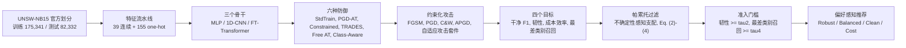

# 面向偏好感知 IDS 防御选择的骨干条件化帕累托分析框架

[English](README.md) | **简体中文**

[](https://www.python.org/)
[](https://pytorch.org/)
[](https://docs.astral.sh/uv/)
[](LICENSE)
[](tests/)

论文的参考实现与评测代码：

> **A Backbone-Conditioned Pareto Analysis Framework for Preference-Aware IDS Defense Selection**
> （面向偏好感知 IDS 防御选择的骨干条件化帕累托分析框架）
> Xiyuan Huang, Na Zhao, Yi Zheng, Xin Su, Shuang Zhao, Qingquan Liao, Yu Tong
> *Big Data and Cognitive Computing*, 2026

本框架把对抗场景下的 IDS 防御选择建模为**多目标决策问题**：每种候选防御用四维画像描述，
先通过帕累托过滤剔除被支配的候选，再用准入门槛淘汰不安全的候选，最后根据部署偏好向量给出
推荐。实验覆盖三个骨干（MLP、1D-CNN、FT-Transformer）、六种防御、十个随机种子、四种攻击族、
四个扰动预算以及一整套自适应攻击。



---

## 主要结果

以下数字全部来自**修订版协议**：UNSW-NB15 官方划分（训练 175,341 / 测试 82,332）、
十个随机种子、评测 PGD 使用 epsilon/10 的步长迭代 50 步。参考场景为 PGD、epsilon = 0.10。
完整表格与逐条复现命令见 [docs/results.md](docs/results.md)。

**PGD（epsilon = 0.10）下的攻击成功率 %，越低越好**

| 防御 | MLP | 1D-CNN | FT-Transformer |
|---|---:|---:|---:|
| StdTrain（不设防） | 15.82 | 19.03 | 10.79 |
| PGD-AT | 0.33 | 1.56 | **0.25** |
| Constrained AT | 3.63 | 5.65 | 0.66 |
| TRADES | **0.21** | **0.53** | 0.38 |
| Free AT | 7.91 | 10.29 | 5.69 |
| Class-Aware AT | 1.03 | 3.11 | 0.46 |

**推荐哪种防御同时取决于骨干与部署偏好。** 选择过程使用不确定性感知帕累托前沿
（均值 +/- 1 倍标准差），并设准入门槛 tau2 = 0.90（韧性）与 tau4 = 0.60（最差类别召回），
因此"不设防"不再可能被推荐：

| 偏好预设 (phi1, phi2, phi3, phi4) | MLP | 1D-CNN | FT-Transformer |
|---|---|---|---|
| Robust (0.10, 0.60, 0.10, 0.20) | PGD-AT | TRADES | PGD-AT |
| Balanced (0.25, 0.35, 0.20, 0.20) | PGD-AT | PGD-AT | PGD-AT |
| Clean (0.50, 0.15, 0.15, 0.20) | Free AT | Constrained | Free AT |
| Cost (0.20, 0.20, 0.50, 0.10) | Free AT | PGD-AT | Constrained |


*四维画像在（干净 F1, 韧性）平面上的投影。星号表示可准入的不确定性感知帕累托前沿；
空心标记（三骨干的 StdTrain，以及 1D-CNN 的 Free AT）为保留展示、但被准入门槛淘汰的候选。
由 `scripts/pareto_selection.py` 生成。*

相比投稿版，修订版新增了以下内容：

- **官方划分 + 十个种子。** 所有配置重复十个种子，报告均值 +/- 标准差，并给出配对检验、
  Holm/BH 多重校正、效应量与 bootstrap 置信区间。
- **不确定性感知帕累托。** 采用论文 Eq. (4) 的区间支配判据后，三个骨干的帕累托前沿都保留
  全部六个候选；而点估计前沿在 FT-Transformer 上排除 TRADES（投稿版 6 -> 5 -> 4 的收缩
  并不成立）。施加准入门槛后，可准入前沿分别为 5 / 4 / 5 个候选。
- **敏感性与稳健性分析。** 偏好单纯形扫描与精确切换超平面、准入门槛扫描、leave-one-out
  候选扰动，以及无 Pareto 加权和、TOPSIS、fixed-[0, 1] 归一化、NSGA-II、MOEA/D、AHP 的对照。
  在 6 个离散候选上，NSGA-II 与 MOEA/D 都能恢复枚举出的帕累托前沿，且在全部 12 个预设单元中
  与确定性加权选择一致；AHP 能把预设权重恢复到机器精度。真正改变推荐的是 TOPSIS 与归一化变体。
- **加权和的数学局限。** MLP 的 Constrained PGD-AT 与 FT-Transformer 的 TRADES 是
  *unsupported* 有效解：在加权和规则下不存在任何非负权重向量能选中它们；改用增广加权
  Tchebycheff 规则（增广系数 0.1）后二者可达。
- **攻击与数据集证据。** 自适应攻击（重启 PGD、无梯度 NES、complement attack）未发现梯度
  遮蔽；跨骨干迁移攻击在对抗训练模型之间最高仅 0.4% ASR；CIC-IDS2017 跨数据集检查保持顶层
  排序；FT-Transformer 容量消融与长预算消融界定了结论范围。

### 修订说明：投稿版使用了反向划分

投稿版论文用 82,332 条训练、175,341 条测试，即把 UNSW-NB15 的标准划分**方向反了**
（审稿人明确指出了这一点）。修订版使用官方方向（训练 175,341 / 测试 82,332），并重算了
全部表格、图与讨论。因此绝对数值与部分排名和投稿版不同；修订版数字取代旧数字，两者不能
混用。特别地，投稿版的"最优防御"结论不再保留：在修正后的协议下，MLP 与 1D-CNN 上韧性
最好的是 TRADES，FT-Transformer 上是 PGD-AT。由于训练/评测预算、准入门槛与决策层也做了
修订，表 6 的推荐还有一部分差异来自规则本身。新旧对照与证据链见
[docs/results.md](docs/results.md)。

---

## 快速开始

本项目使用 [uv](https://docs.astral.sh/uv/) 管理依赖。请先安装 uv
（`curl -LsSf https://astral.sh/uv/install.sh | sh`，或参考 uv 文档中的其它安装方式），然后：

```bash
git clone https://github.com/huangxyy/bdcc-ids-defense-selection.git
cd bdcc-ids-defense-selection

# 创建环境，并按 uv.lock 安装锁定版本的依赖
uv sync

# 1. 数据集已随仓库提供（见下文"数据集"），先校验：
uv run python scripts/prepare_data.py

# 2. 几秒钟：确认环境与数据可用
uv run python scripts/smoke_test.py

# 3. 完整复现（三个骨干串行；建议使用 GPU）
uv run python scripts/run_experiments.py --device cuda

# 4. 端到端验证当前检出（数据、lint、测试、冒烟、dry-run）
make verify
```

`uv run` 会在项目环境中执行命令，无需手动激活环境；下文所有 `python ...` 示例都应以同样方式运行
（即 `uv run python ...`）。解释器版本由 `.python-version` 固定，缺失时 uv 会自动安装。
所有路径都相对仓库根目录解析，因此下文的每条命令都可以在任意工作目录下执行。

`make verify` 是统一的验证入口；`make quick` 只跑快检（数据 + lint + 测试），约半分钟。
验证分层、论文内容与命令的对应表、修订版验收标准见 [docs/verification.md](docs/verification.md)，
目录约定见 [docs/structure.md](docs/structure.md)。

---

## 在 GPU 服务器上运行

解释器由 `.python-version`（`3.12`）固定、依赖由 `uv.lock` 固定，所以一台新服务器只需要装
uv，不需要 root，也不用自己配 CUDA 工具链。依赖下载默认走**清华 PyPI 镜像**
（配置在 `pyproject.toml` 里），国内服务器不用再等 `pypi.org`；国外环境可用
`UV_DEFAULT_INDEX=https://pypi.org/simple uv sync` 切回官方源。两种服务器用法都有一键脚本：

```bash
bash scripts/setup_server.sh          # uv sync（走镜像，CPython 3.12 + 锁定依赖）
bash scripts/setup_server.sh --pip    # 复用已有的 conda torch，只 pip 安装其余依赖
```

```bash
# 只需要执行一次，无需 root
curl -LsSf https://astral.sh/uv/install.sh | sh

cd bdcc-ids-defense-selection
uv sync                       # 自动下载 CPython 3.12 与锁定的 CUDA 版 torch
uv run python scripts/check_devices.py
```

`check_devices.py` 会打印 torch 的 CUDA 构建、每块可见 GPU（型号/显存/算力）以及 `auto`
解析到的设备；同样的值会写进每次运行的 `run_summary.json`（`resolved_device`），因此不会
出现悄悄退回 CPU 的情况。

如果 `check_devices.py` 显示没有可用 GPU、而 `nvidia-smi` 能看到显卡，说明 torch 的 CUDA
构建与驱动不匹配，改装对应 CUDA 版本的轮子：

```bash
# 例：CUDA 13.0 版本（RTX 50 系 / Blackwell 需要较新的 CUDA 构建）
uv pip install --python .venv/bin/python --reinstall torch \
    --index-url https://download.pytorch.org/whl/cu130
uv run python scripts/check_devices.py     # 期望 "available    : True"
```

其它版本（`cu128`、`cu126`、`cu118` 等）见 <https://download.pytorch.org/whl/>。
这种安装方式不受 `uv.lock` 约束，之后再执行普通的 `uv sync` 会恢复锁定的 torch；
如果 GPU 又不可用，重跑上面的命令即可。实测参考：驱动 595 / CUDA 13.2 + RTX 5090
可以直接使用默认的 `uv sync` 安装。

---

## 数据集

UNSW-NB15 的两个官方划分**已随仓库提供**（已去掉 BOM，方向为官方方向）：

- **[data/train.csv](data/train.csv)** —— 175,341 条（官方训练划分）
- **[data/test.csv](data/test.csv)** —— 82,332 条（官方测试划分）

因此新机器（或 GPU 服务器）只需 `git clone` / `git pull` 就能开跑，无需再单独下载。
上游来源：<https://research.unsw.edu.au/projects/unsw-nb15-dataset>；如果你自行下载，
请保持同样的文件名：

```
data/train.csv    175,341 条    <- 官方 UNSW_NB15_training-set.csv
data/test.csv      82,332 条    <- 官方 UNSW_NB15_testing-set.csv
```

这是**官方的划分方向**：较大的划分用于训练。一个常见错误是把下载的两个文件直接命名为
train/test 而没有确认哪个是哪个，这会悄悄把划分方向反过来。`scripts/prepare_data.py`
能够检测出这种情况，并用 `--fix-swap` 修复：

```bash
uv run python scripts/prepare_data.py --fix-swap
```

CIC-IDS2017 **不在仓库中**（可选，只有跨数据集脚本需要）；详见
[data/README.zh-CN.md](data/README.zh-CN.md)。

---

## 仓库结构

```
bdcc-ids-defense-selection/
├── pyproject.toml                            # 项目元数据与依赖（uv）
├── uv.lock                                   # 完整锁定的依赖版本
├── .python-version                           # uv 使用的解释器版本
├── Makefile                                  # make verify / test / lint / smoke / dry-run
├── docs/
│   ├── structure.md                          # 仓库布局与约定
│   ├── verification.md                       # 验证层级、命令与产物对应表
│   ├── results.md                            # 修订版结果（表 3-7）与证据链
│   └── figures/                              # README 插图（帕累托前沿、epsilon 敏感性）
├── src/
│   └── ids_defense_selection/                # 库（所有可导入的实现）
│       ├── config.py                         # ExperimentConfig 与自动生成的 CLI
│       ├── paths.py                          # 相对仓库根的路径解析
│       ├── device.py                         # auto/cpu/cuda/mps 解析与报告
│       ├── data.py                           # 特征工程、数据加载、随机种子
│       ├── backbones.py                      # MLP / 1D-CNN / FT-Transformer
│       ├── attacks.py                        # FGSM / PGD / C&W / APGD 与约束
│       ├── defenses.py                       # 六种防御、可选扩展、敏感度掩码
│       ├── evaluation.py                     # 指标、预测、共享评测循环
│       ├── adaptive.py                       # 重启 PGD、NES、complement attack
│       ├── phi4.py                           # 最差类别召回评测
│       ├── reporting.py                      # 聚合、显著性检验、图表
│       ├── selection.py                      # 帕累托过滤 + 偏好加权选择
│       ├── supportedness.py                  # supported/unsupported 有效解判定
│       ├── stats.py                          # Holm/BH、效应量、bootstrap 工具
│       ├── checkpoints.py                    # 防御权重存档与加载
│       ├── spec.py                           # 官方划分规格
│       └── style.py                          # 共享 matplotlib 样式与配色
├── scripts/                                  # 入口脚本（CLI 与实验编排）
│   ├── _bootstrap.py                         # 把 src/ 加入 sys.path，保证脚本随处可跑
│   ├── run_experiments.py                    # 一条命令复现三个骨干网络
│   ├── run_mlp.py / run_cnn1d.py / run_ft_transformer.py
│   ├── evaluate_phi4_cnn.py / evaluate_phi4_ft.py
│   ├── evaluate_phi4_from_checkpoints.py     # 不重训的 phi4 评测
│   ├── pareto_selection.py                   # ids_defense_selection.selection 的 CLI
│   ├── check_supportedness.py                # 加权和可达性的 LP 检验
│   ├── enhance_significance.py               # Holm/BH + 效应量 + bootstrap CI
│   ├── bootstrap_dominance.py                # 种子重采样下的前沿稳定性
│   ├── check_aggregation_robustness.py       # 均值 vs 中位数
│   ├── export_paper_tables.py                # 表 3-7 -> CSV/Markdown
│   ├── export_epsilon_sensitivity.py         # epsilon 敏感性表/图
│   ├── evaluate_cross_backbone_transfer.py   # 迁移攻击矩阵
│   ├── transfer_from_checkpoints.py          # 不重训的迁移攻击
│   ├── evaluate_checkpoints.py               # 只评测复用
│   ├── run_cicids2017.py                     # CIC-IDS2017 跨数据集运行
│   ├── run_cicids2017_source_disjoint.py     # 源域不重叠的 CIC-IDS2017 变体
│   ├── sweep_hyperparameters.py              # TRADES beta / 类别权重敏感性
│   ├── analyze_extended.py                   # epsilon 扫描、ROC、梯度遮蔽
│   ├── prepare_data.py                       # 校验 / 修复数据集目录
│   ├── smoke_test.py                         # 快速端到端自检
│   ├── check_devices.py                      # CPU / CUDA / MPS 可用性报告
│   ├── check_outputs.py                      # 校验已完成的 outputs/ 产物
│   ├── log_experiment.py                     # 可追溯的 markdown 实验记录
│   ├── verify.py                             # 一条命令完成验证（make verify）
│   ├── setup_server.sh                       # 服务器一键安装（自动走国内镜像）
│   └── make_figures_matlab.m                 # 遗留 MATLAB 出图脚本（见说明）
├── tests/                                    # 单元、集成与结构测试
├── data/                                     # UNSW-NB15 官方划分（随仓库提供）
└── outputs/                                  # 实验输出（不入版本库；见 outputs/README.md）
```

### 各脚本与论文结果的对应关系

| 论文内容 | 对应脚本 / 命令 |
|---|---|
| 表 3-5，四维画像 | `run_mlp.py`、`run_cnn1d.py`、`run_ft_transformer.py` + `pareto_selection.py` |
| 表 6-7，帕累托与偏好选择 | `pareto_selection.py` + `export_paper_tables.py` |
| phi4（最差类别召回） | `evaluate_phi4_cnn.py`、`evaluate_phi4_ft.py`、`evaluate_phi4_from_checkpoints.py` |
| 显著性（Holm/BH、效应量、CI） | `enhance_significance.py` |
| supported/unsupported 有效解 | `check_supportedness.py` |
| bootstrap 前沿稳定性 | `bootstrap_dominance.py` |
| 均值 vs 中位数聚合 | `check_aggregation_robustness.py` |
| epsilon 敏感性表/图 | `export_epsilon_sensitivity.py` |
| 跨数据集检查 | `run_cicids2017_source_disjoint.py` |
| 容量 / 长预算消融 | `run_ft_transformer.py --ft-capacity ...`、`--baseline-epochs 20 --adv-epochs 16` |
| 跨骨干迁移攻击 | `evaluate_cross_backbone_transfer.py`、`transfer_from_checkpoints.py` |
| 自适应攻击 | `run_* --adaptive-eval`、`evaluate_checkpoints.py --adaptive-eval` |
| 全测试集攻击 | `run_cnn1d.py` / `run_ft_transformer.py`（原生）；MLP 用 `evaluate_checkpoints.py --full-test-attack-rows 0` 补跑 |
| 敏感度比例消融（仅 MLP） | `run_mlp.py`（`ratio_ablation_*`） |

其余脚本（`sweep_hyperparameters.py`、`analyze_extended.py`）实现的是附加的敏感性分析。
`make_figures_matlab.m` 仅作参考保留（论文图表使用该脚本的样式）。它的 `riskData()` 已换成
修订版快照（官方划分、10 seeds、准入阈值），并为不可准入候选加了空心标记，用于图 2/图 3；
其中的图 5 风险曲面仍是投稿版数据，复用前需要更新。可复现的图请使用 Python 流程写入的
`outputs/figures/`。

---

## 运行实验

### 修订版协议（十个种子、官方划分）

以下命令用于复现修订版论文的表格：

```bash
# MLP（把脚本名换成 run_cnn1d.py / run_ft_transformer.py 即可跑另外两个骨干）
uv run python scripts/run_mlp.py --device cuda --save-checkpoints \
  --seeds 7,13,21,42,100,11,23,37,59,89 \
  --eval-attack-rows 20000 \
  --epsilon-list 0.02,0.05,0.10,0.20 \
  --eval-pgd-alpha-ratio 0.10 --eval-pgd-steps 50
```

三个骨干使用完全相同的参数（FT-Transformer 保持批大小 512 与 7 步训练 PGD，评测协议与
其它骨干一致）。自适应攻击按需开启：

```bash
uv run python scripts/run_mlp.py --device cuda --adaptive-eval \
  --adaptive-steps 50 --adaptive-restarts 5 --seeds 7,13,21
```

主实验完成后，重建决策产物与论文表格：

```bash
uv run python scripts/pareto_selection.py --ref-attack pgd --ref-epsilon 0.10 \
  --confidence-margin 1.0 --min-phi2 0.90 --min-phi4 0.60
uv run python scripts/check_supportedness.py --tchebycheff-rho 0.1
uv run python scripts/enhance_significance.py
uv run python scripts/bootstrap_dominance.py
uv run python scripts/check_aggregation_robustness.py
uv run python scripts/export_epsilon_sensitivity.py --attack pgd
uv run python scripts/export_paper_tables.py
uv run python scripts/check_outputs.py --require-analysis
```

### 微型实验（几分钟，CPU 可跑）

```bash
uv run python scripts/run_mlp.py \
  --seeds 1 --baseline-epochs 1 --adv-epochs 1 \
  --adv-steps 2 --eval-pgd-steps 2 --eval-attack-rows 1000 \
  --epsilon-list 0.05 --output-dir outputs/mlp_smoke
uv run python scripts/pareto_selection.py --ref-attack pgd --ref-epsilon 0.05
```

### 设备选择

`--device` 支持 `auto`（默认）、`cpu`、`cuda`、`cuda:N` 和 `mps`。`auto` 会优先使用可见的
CUDA GPU，其次 Apple MPS，最后回退到 CPU；在没有 GPU 的机器上显式指定 `cuda` 会立即报出明确
错误，而不是抛出一段难以理解的 torch 异常。解析结果会在启动时打印，并作为 `resolved_device`
记录在 `run_summary.json` 中。

```bash
uv run python scripts/check_devices.py                  # 查看 CPU / CUDA / MPS
uv run python scripts/run_experiments.py                # 自动选择设备
uv run python scripts/run_mlp.py --device cpu           # 固定用 CPU
uv run python scripts/run_mlp.py --device cuda:1        # 固定用某块 GPU
```

### 大显卡放大运行

```bash
uv run python scripts/run_experiments.py --backbones ft --ft-capacity medium --device cuda
uv run python scripts/run_experiments.py --device cuda \
  --seeds 7,13,21,42,100,11,23,37,59,89 --eval-attack-rows 82332 \
  --epsilon-list 0.02,0.05,0.10,0.15 --adaptive-eval \
  --adaptive-steps 100 --adaptive-restarts 10
```

上面的例子保持训练协议不变，把算力花在**证据规模**上：10 个种子、完整 82,332 条测试划分、
4 个扰动预算、100 步 × 10 次重启的自适应攻击。`--ft-capacity medium|large` 切换到
FT-Transformer 容量消融预设（d_token 64 / 4 heads / 3 layers / d_ffn 128，或
128 / 8 / 4 / 256），主实验保持 `paper` 容量。

全部 56 个配置字段都可以在编排脚本里用可重复的 `--set 字段=值` 覆盖（优先于其他参数与预设）：

```bash
uv run python scripts/run_experiments.py --device cuda \
  --seeds 7,13,21,42,100,11,23,37,59,89 --eval-attack-rows 82332 \
  --set baseline_epochs=20 --set adv_epochs=16 --set batch_size=2048 \
  --set ft_d_token=96 --set ft_n_heads=6 --set ft_n_layers=4 --set ft_d_ffn=384 \
  --set learning_rate=2e-3 --set adv_epsilon=0.09
```

### 训练一次、评测多次

`--save-checkpoints` 会把共享基线、六种防御、掩码、训练成本表和完整配置存到
`<output-dir>/checkpoints/seed<seed>/`；之后换评测参数不用再训练：

```bash
uv run python scripts/run_ft_transformer.py --device cuda --save-checkpoints \
  --output-dir outputs/ft_transformer

uv run python scripts/evaluate_checkpoints.py \
  --checkpoint outputs/ft_transformer/checkpoints/seed7 \
  --output-dir outputs/ft_eval_probe --device cuda \
  --eval-pgd-alpha-ratio 0.10 --eval-pgd-steps 50 \
  --epsilon-list 0.05,0.10,0.20 --adaptive-eval
```

各个骨干网络**故意串行运行**：并行运行会让它们争抢 GPU，从而污染用于目标 phi3 的训练成本测量。

### 输出文件

每次运行写入 `outputs/<backbone>/`：

```
raw_results.csv            每个 (种子, 防御, 攻击, epsilon) 一行
mean_results.csv           按 (防御, 攻击, epsilon) 聚合的种子均值
std_results.csv            同一批单元格的种子标准差
significance_tests.csv     防御两两之间的配对 t 检验与 Wilcoxon 检验
significance_enhanced.csv  Holm/BH 校正 p 值、Cohen's d_z、bootstrap 置信区间
efficiency_mean.csv        参数量、训练耗时、推理延迟
attack_generalization.csv  对训练从未见过的攻击族的鲁棒性
adaptive_attack_*.csv      自适应攻击套件（开启 --adaptive-eval 时）
category_*.csv             按攻击类别的召回（phi4 输入）
hyperparameters.csv        全部配置字段（分组、取值、说明）
run_summary.json           实际使用的完整配置
risk_profile_4d.csv        四维画像 + 帕累托/准入标记
supportedness.csv          supported/unsupported 有效解
```

决策层还会写出 `decision_comparators.csv`、`candidate_dependence.csv`、`theta_sweep.csv`、
`theta_summary.csv`、`switching_regions.json`、`admissibility_sweep.csv`、
`pareto_selection_results.csv` 与 `outputs/decision_settings.json`；完整清单见
[outputs/README.md](outputs/README.md)。

### 最差类别召回（phi4）

```bash
uv run python scripts/evaluate_phi4_cnn.py --device cuda --output-dir outputs/phi4_cnn
uv run python scripts/evaluate_phi4_ft.py  --device cuda --output-dir outputs/phi4_ft
```

两个脚本默认使用论文的五个随机种子；修订版跑了十个种子，并提供了复用已训练权重的
`evaluate_phi4_from_checkpoints.py`。FT-Transformer 训练时使用 7 步 PGD，评测时使用与其它
骨干一致的协议；两个预算会分别记录在 `run_summary.json` 中。

### 帕累托过滤与选择

```bash
uv run python scripts/pareto_selection.py --ref-attack pgd --ref-epsilon 0.10

# 论文设置：不确定性感知帕累托（均值 +/- 1 倍标准差）+ 准入门槛
uv run python scripts/pareto_selection.py --ref-attack pgd --ref-epsilon 0.10 \
  --confidence-margin 1.0 --min-phi2 0.90 --min-phi4 0.60
```

`risk_profile_4d.csv` 会带上各目标的标准差，以及"统计判定"和"点估计判定"两种帕累托标记；
`outputs/decision_settings.json` 记录产生推荐所用的门槛与置信度余量。

### 预期运行时间

单 GPU、完整官方划分。FT-Transformer 占总成本的绝大部分。

| 骨干网络 | 单种子、六种防御（RTX 4060） | 五个种子（RTX 4060） | 十个种子（RTX 5090，含评测） |
|---|---|---|---|
| MLP | 约 8 分钟 | 约 40 分钟 | 约 1.5-2 小时 |
| 1D-CNN | 约 15 分钟 | 约 1.3 小时 | 约 2-3 小时 |
| FT-Transformer | 约 2.8 小时 | 约 14 小时 | 约 6-8 小时 |

所有骨干网络也能在 CPU 上运行，但会慢得多。三个骨干不要并行跑：它们会争抢 GPU 并污染
phi3 的训练成本比值。
开启自适应评测（`--adaptive-eval`）会在主运行之外再增加数小时。

---

## 超参数

代码默认值较保守；论文报告的是"修订版协议"一列。

| 设置 | 代码默认 | 修订版协议 |
|---|---|---|
| 训练协议 | 匹配延续（matched continuation）：10 个干净 epoch + 8 个延续 epoch | 相同 |
| 优化器 | Adam，lr = 1e-3，weight decay = 1e-5 | 相同 |
| 批大小 | 1024（MLP、1D-CNN）；512（FT-Transformer） | 相同 |
| Dropout | 0.15 | 相同 |
| FT-Transformer 容量 | d_token 32、heads 2、layers 2、d_ffn 64 | 相同（`paper`）；消融使用 `medium`/`large` 预设 |
| 随机种子 | 7、13、21、42、100 | 再加 11、23、37、59、89（共十个） |
| 评测子集 | 20,000 条分层测试样本，子集种子 2026 | 相同，所有防御共享 |
| 对抗训练预算 | epsilon 0.06、alpha 0.015、20 步 PGD（FT 为 7 步） | 相同 |
| 评测扰动预算 | epsilon ∈ {0.02, 0.05, 0.10} | epsilon ∈ {0.02, 0.05, 0.10, 0.20} |
| 评测 PGD | 20 步，步长 0.05 epsilon | 50 步，步长 0.10 epsilon |
| 准入门槛 | 无（`--min-phi2 0 --min-phi4 0`） | tau2 = 0.90，tau4 = 0.60 |
| 支配余量 | 0（点估计） | 1.0 倍标准差，Eq. (4) |
| 设备 | `auto`（CUDA -> MPS -> CPU） | GPU 服务器上显式 `cuda` |

| 防御 | 训练时攻击 | 掩码 | 额外设置 |
|---|---|---|---|
| StdTrain | 无 | - | - |
| PGD-AT | PGD | 全部 39 个连续特征 | - |
| Constrained | PGD | 最敏感的 top-30% 特征 | - |
| TRADES | KL 上的 PGD | 全部连续特征 | beta = 6.0 |
| Free AT | 重放式 PGD | 全部连续特征 | 重放 m = 4 |
| Class-Aware | PGD | 按类别取 top-30% | 少数类权重 = 3.0 |

评测攻击：FGSM；PGD；C&W L2（30 步，lr = 0.01，c = 1.0）；APGD-CE（50 步，rho = 0.75）。
C&W 实现本身不依赖 epsilon，因此单列报告，不参与预算扫描。

> **训练预算与评测预算不同。** 对抗训练使用 epsilon = 0.06，而评测最高扫到 0.20。
> 两个 PGD 步数是相互独立的字段（训练用 `--adv-steps`，评测用 `--eval-pgd-steps`），
> 因此骨干网络不可能再用缩减后的训练步数悄悄完成评测。

---

## 完整参数化

**`ExperimentConfig` 的每个字段都是一个命令行参数。** 参数由 dataclass 自动生成，因此 CLI
不可能与配置脱节：给 `ExperimentConfig` 增加一个字段，就会自动增加一个参数。全部 56 个字段
在三个骨干脚本中完全一致。

每个字段的帮助文本和旧参数别名都写在 dataclass 元数据里；配置在构造时就会做校验：像
`--batch-size 0`、未知的攻击名或格式错误的元组，都会立即报出一条可读的错误，并一次性列出
所有问题。

为了方便维护和一眼看清实验设置，同样的字段还按域拆成七个不可变分组——`paths`、`training`、
`attack`、`evaluation`、`methods`、`sensitivity`、`runtime`，每组自己校验自己的字段。
`--print-config` 和 `run_summary.json` 都按这个结构输出；在 Python 里也可以用
`config.training.batch_size`、`config.evaluation.epsilon_list`、`config.runtime.device` 访问，
而代码里原有的扁平访问（`config.batch_size`）保持不变。

```bash
uv run python scripts/run_cnn1d.py --help              # 查看完整参数列表与默认值
uv run python scripts/run_mlp.py --train-path data/train.csv --test-path data/test.csv --print-config
```

复杂类型用逗号分隔的字符串解析：

| 字段类型 | 参数示例 |
|---|---|
| `int` / `float` / `str` | `--adv-epsilon 0.05` |
| `tuple[int, ...]` | `--hidden-dims 256,128,64` |
| `tuple[float, ...]` | `--epsilon-list 0.02,0.05,0.10` |
| `tuple[str, ...]` | `--reference-models log_reg,hist_gbdt` |
| `tuple[tuple[str, float], ...]` | `--transfer-attack-settings fgsm:0.05,pgd:0.10` |

未传入的字段保持 dataclass 默认值；`--print-config` 会在开始任何工作之前以 JSON 打印生效配置：

```bash
uv run python scripts/run_ft_transformer.py --seeds 1,2,3 --adv-epsilon 0.09 --print-config
```

一些有代表性的用法：

```bash
# 换一种 MLP 结构，并使用不同的评测预算列表
uv run python scripts/run_mlp.py --train-path data/train.csv --test-path data/test.csv \
    --hidden-dims 256,128,64 --dropout 0.3 --epsilon-list 0.02,0.05,0.10

# 用三个种子代替五个
uv run python scripts/run_cnn1d.py --seeds 7,42,100

# 修订版使用的 eps/10 PGD 步长
uv run python scripts/run_mlp.py --eval-pgd-alpha-ratio 0.10 --eval-pgd-steps 50
```

### 可选的额外防御方法

本仓库还包含三种**不属于**论文所评测的六种防御的实现：Progressive Class-Aware
Constrained AT、SA-TRADES 和 DST-SA-TRADES。它们被完整保留，以便实现可查、可复现，但只有在显式
请求时才会训练：

```bash
uv run python scripts/run_mlp.py --extra-methods progressive,sa_trades,dst_sa_trades
```

默认（空）设置下，代码只训练论文报告的六种防御，不会训练其它任何东西。启用后，每种额外方法会加入与
六种防御相同的注册表，并流经完全一致的评测、成本与选择代码路径。

---

## 可复现性

`ids_defense_selection.set_seed()` 会为 Python、NumPy 和 PyTorch 设置随机种子，**并**关闭 cuDNN 的
非确定性：

```python
torch.backends.cudnn.deterministic = True
torch.backends.cudnn.benchmark = False
os.environ.setdefault("CUBLAS_WORKSPACE_CONFIG", ":4096:8")
```

这些设置使得同机同种子的两次运行结果一致。FT-Transformer 论文配置的跨环境复现（同一种子、第二台
服务器、不同驱动与 Python 环境）显示 phi1 与 phi2 的差异不超过 4 x 10^-4，远小于种子间波动；
最差类别召回对不设防模型最敏感（0.088），训练成本比是设备相关量，只在同一次运行内比较。

每次运行还会写出 `run_summary.json`（完整配置、解析设备、划分方向证据）与
`hyperparameters.csv`（由配置 dataclass 自动生成的 56 个字段），因此论文中的任何数字都不需要
手工追溯。`scripts/log_experiment.py` 可以把一个已完成的 `outputs/` 目录转成数字自动提取自
CSV 的 markdown 实验记录。

---

## 开发

库代码位于 `src/ids_defense_selection/`，`scripts/` 下的脚本只是薄入口。凡是要被单元测试的逻辑都放进
库里（例如帕累托决策逻辑是 `ids_defense_selection/selection.py`，`scripts/pareto_selection.py` 只是
它的 CLI）。安装开发工具并在仓库根目录运行检查：

```bash
uv sync --group dev
make quick             # 数据校验 + lint + 测试（约十五秒）
make verify            # 再加真实数据冒烟测试与 dry-run
uv run pytest          # 直接运行 121 个测试
uv run ruff check      # 静态检查（含未定义名称）
```

测试会构造一个小型、形如 UNSW-NB15 的合成数据集，因此既不需要真实数据，也不需要 GPU。
`tests/test_structure.py` 会强制检查目录约定，新增脚本若不能在任意工作目录运行会被测试直接拦下。

---

## 文档地图

| 文档 | 内容 |
|---|---|
| [docs/results.md](docs/results.md) | 修订版结果：表 3-7、显著性、稳健性证据与复现命令 |
| [docs/verification.md](docs/verification.md) | 验证层级、论文内容与命令对应表、验收标准 |
| [docs/structure.md](docs/structure.md) | 仓库布局与编码约定 |
| [outputs/README.md](outputs/README.md) | 流水线写出的全部产物说明 |
| [data/README.zh-CN.md](data/README.zh-CN.md) | 数据来源、下载与放置方式 |

---

## 关于特征空间的说明

one-hot 的宽度取决于**训练**划分中包含多少类别取值，因此它是划分本身的属性，而非固定常数。使用官方
划分时，本代码会产生 **194 个变换后特征（39 个连续 + 155 个 one-hot）**。投稿版论文报告的是 190，
对应投稿实验所使用的反向划分。`smoke_test.py` 会打印实际得到的数值，因此两者不会被悄悄混淆。

扰动只作用于 39 个连续特征、并被限制在训练集的 `[min, max]` 盒内。盒约束优先于 epsilon 球，
因此极少数取值落在训练范围之外的测试样本的位移可能超过 epsilon；`attack_validity_*.csv` 用
`max_numeric_abs_delta` 与 `boundary_clip_ratio` 量化了这一现象，完整解释见
[docs/results.md](docs/results.md)。

---

## 引用

```bibtex
@article{huang2026backbone,
  title   = {A Backbone-Conditioned Pareto Analysis Framework for
             Preference-Aware IDS Defense Selection},
  author  = {Huang, Xiyuan and Zhao, Na and Zheng, Yi and Su, Xin and
             Zhao, Shuang and Liao, Qingquan and Tong, Yu},
  journal = {Big Data and Cognitive Computing},
  year    = {2026}
}
```

## 许可证

MIT，详见 `LICENSE`。

## 联系方式

Xiyuan Huang - huangxiyuan2020@qq.com - [@huangxyy](https://github.com/huangxyy)

欢迎通过 issue 跟踪器提问、报告问题或提交 pull request：
<https://github.com/huangxyy/bdcc-ids-defense-selection/issues>。
