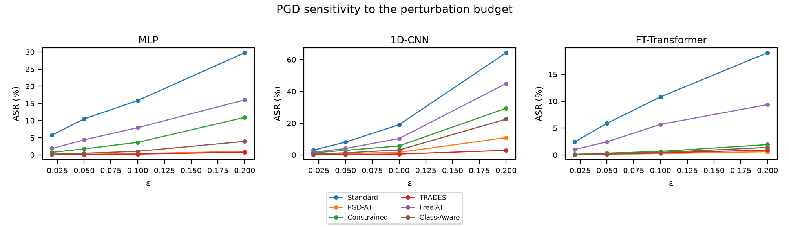

# Revision results (official split, ten seeds)

This document is the GitHub-readable snapshot of the numbers reported in the revised
manuscript. Everything here is regenerated from `outputs/` by the commands in
[Regenerate](#regenerate); the CSVs under `outputs/tables/` are the machine-readable source.

**Protocol.** UNSW-NB15 official split (175,341 training / 82,332 testing records, 194
transformed features = 39 continuous + 155 one-hot), ten seeds
(`7,13,21,42,100,11,23,37,59,89`), matched-continuation training (10 clean + 8 continuation
epochs, epsilon_train = 0.06), evaluation PGD with step size epsilon/10 for 50 iterations, and
the 20,000-row stratified evaluation subset shared by all defenses.

**Decision settings.** Reference scenario PGD at epsilon = 0.10; uncertainty margin 1.0 standard
deviation (Eq. 4); admissibility floors tau2 = 0.90 (resilience) and tau4 = 0.60 (worst-class
recall); preferences from the manuscript presets.

---

## 1. Why the revised numbers differ from the submitted version

The submitted manuscript used the UNSW-NB15 partition **reversed** (82,332 training / 175,341
testing records; 190 transformed features), a point the reviewer explicitly identified. The
revision corrects the split direction and regenerates everything.

| Aspect | Submitted | Revised |
|---|---|---|
| Training / testing records | 82,332 / 175,341 (reversed) | 175,341 / 82,332 (official) |
| Transformed features | 190 | 194 (39 continuous + 155 one-hot) |
| Seeds | single run | ten seeds, mean +/- std |
| Evaluation PGD | 20 steps | 50 steps at alpha = epsilon/10 |
| Dominance rule | point estimate | Eq. (4), margin = 1 std |
| Admissibility floors | none | tau2 = 0.90, tau4 = 0.60 |
| Best resilience, MLP | PGD-AT (phi2 = 0.9587) | TRADES (0.9979) |
| Best resilience, 1D-CNN | Class-Aware (0.8562) | TRADES (0.9947) |
| Best resilience, FT-Transformer | PGD-AT (0.9540) | PGD-AT (0.9975) |

Consequences for the manuscript narrative:

- Absolute values are not comparable across versions; the submitted numbers and the revised
  numbers must never be mixed in one table.
- The submitted 6 -> 5 -> 4 Pareto contraction does not survive: with Eq. (4) all six candidates
  remain on the front for all three backbones before the admissibility floors; after the floors
  the admissible fronts contain 5 / 4 / 5 candidates, and only the FT-Transformer
  point-estimate front excludes TRADES.
- The submitted "best defense under every robustness preference" claim is not preserved; the
  recommendation is backbone- and preference-dependent, which is the paper's thesis.
- Cost-preset recommendations changed structurally because the admissibility floors remove the
  undefended baseline from the candidate set.

---

## 2. Tables 3-5: four-dimensional profiles

Every cell is mean +/- standard deviation over ten seeds. `Pareto (Eq. 4)` and `Pareto (point)`
are computed on the **admissible** candidate set (floors applied first); `Supported` marks
whether the point can be selected by any non-negative weighted sum (Section 6). Without the
floors, the Eq. (4) front keeps all six candidates on each backbone, and the only
uncertainty-versus-point-estimate difference is FT TRADES.

### Table 3. MLP

| Defense | phi1 clean F1 | phi2 resilience | phi3 cost efficiency | phi4 worst-class recall | Pareto (Eq. 4) | Pareto (point) | Admissible | Supported |
|---|---|---|---|---|---|---|---|---|
| Standard | 0.8822 +/- 0.0050 | 0.8418 +/- 0.0102 | 1.0000 +/- 0.0000 | 0.3647 +/- 0.0154 | no | no | no | - |
| PGD-AT | 0.8564 +/- 0.0008 | 0.9967 +/- 0.0011 | 0.2083 +/- 0.0086 | 0.9687 +/- 0.0058 | yes | yes | yes | yes |
| Constrained | 0.8607 +/- 0.0027 | 0.9637 +/- 0.0210 | 0.2073 +/- 0.0055 | 0.7904 +/- 0.1286 | yes | yes | yes | **no** |
| TRADES | 0.8557 +/- 0.0002 | 0.9979 +/- 0.0004 | 0.1658 +/- 0.0055 | 0.9643 +/- 0.0058 | yes | yes | yes | yes |
| Free AT | 0.8755 +/- 0.0076 | 0.9209 +/- 0.0215 | 0.3326 +/- 0.0116 | 0.6045 +/- 0.0878 | yes | yes | yes | yes |
| Class-Aware | 0.8568 +/- 0.0017 | 0.9897 +/- 0.0029 | 0.2039 +/- 0.0072 | 0.9774 +/- 0.0075 | yes | yes | yes | yes |

### Table 4. 1D-CNN

| Defense | phi1 clean F1 | phi2 resilience | phi3 cost efficiency | phi4 worst-class recall | Pareto (Eq. 4) | Pareto (point) | Admissible | Supported |
|---|---|---|---|---|---|---|---|---|
| Standard | 0.8534 +/- 0.0101 | 0.8097 +/- 0.0584 | 1.0000 +/- 0.0000 | 0.4934 +/- 0.1529 | no | no | no | - |
| PGD-AT | 0.8278 +/- 0.0042 | 0.9844 +/- 0.0110 | 0.1836 +/- 0.0094 | 0.9631 +/- 0.0174 | yes | yes | yes | yes |
| Constrained | 0.8362 +/- 0.0087 | 0.9435 +/- 0.0326 | 0.1842 +/- 0.0058 | 0.8522 +/- 0.0936 | yes | yes | yes | yes |
| TRADES | 0.8236 +/- 0.0018 | 0.9947 +/- 0.0042 | 0.1554 +/- 0.0137 | 0.9721 +/- 0.0055 | yes | yes | yes | yes |
| Free AT | 0.8502 +/- 0.0133 | 0.8971 +/- 0.0410 | 0.3178 +/- 0.0162 | 0.7666 +/- 0.1685 | no | no | no | - |
| Class-Aware | 0.8291 +/- 0.0046 | 0.9689 +/- 0.0186 | 0.1853 +/- 0.0093 | 0.9469 +/- 0.0456 | yes | yes | yes | yes |

### Table 5. FT-Transformer

| Defense | phi1 clean F1 | phi2 resilience | phi3 cost efficiency | phi4 worst-class recall | Pareto (Eq. 4) | Pareto (point) | Admissible | Supported |
|---|---|---|---|---|---|---|---|---|
| Standard | 0.8851 +/- 0.0081 | 0.8921 +/- 0.0278 | 1.0000 +/- 0.0000 | 0.6687 +/- 0.1301 | no | no | no | - |
| PGD-AT | 0.8567 +/- 0.0017 | 0.9975 +/- 0.0019 | 0.3334 +/- 0.0037 | 0.9635 +/- 0.0165 | yes | yes | yes | yes |
| Constrained | 0.8578 +/- 0.0051 | 0.9934 +/- 0.0061 | 0.3347 +/- 0.0040 | 0.9534 +/- 0.0297 | yes | yes | yes | yes |
| TRADES | 0.8542 +/- 0.0014 | 0.9962 +/- 0.0033 | 0.2936 +/- 0.0038 | 0.9571 +/- 0.0397 | yes | **no** | yes | **no** |
| Free AT | 0.8780 +/- 0.0173 | 0.9431 +/- 0.0446 | 0.3171 +/- 0.0044 | 0.8259 +/- 0.1513 | yes | yes | yes | yes |
| Class-Aware | 0.8561 +/- 0.0010 | 0.9954 +/- 0.0042 | 0.3316 +/- 0.0043 | 0.9685 +/- 0.0201 | yes | yes | yes | yes |

Notes:

- `phi2 = 1 - ASR` for PGD at epsilon = 0.10; `phi3` is the standard-training cost divided by the
  defense's training cost, so Standard is 1.0 by construction (a structural property, not an
  empirical finding).
- The per-cell CSVs are `outputs/tables/table3_mlp.csv`, `table4_cnn1d.csv`, `table5_ft.csv`.
- The uncertainty-aware front keeps all six candidates on all three backbones; only FT TRADES
  falls off the point-estimate front, and the admissibility floors remove Standard everywhere
  (and Free AT on the 1D-CNN because its phi2 = 0.8971 is below tau2 = 0.90).

---

## 3. Table 6: preference-aware selection

Selections use the admissible, uncertainty-aware front with min-max normalization over the front.

| Preset | theta | MLP | 1D-CNN | FT-Transformer |
|---|---|---|---|---|
| Robust | (0.10, 0.60, 0.10, 0.20) | PGD-AT | TRADES | PGD-AT |
| Balanced | (0.25, 0.35, 0.20, 0.20) | PGD-AT | PGD-AT | PGD-AT |
| Clean | (0.50, 0.15, 0.15, 0.20) | Free AT | Constrained | Free AT |
| Cost | (0.20, 0.20, 0.50, 0.10) | Free AT | PGD-AT | Constrained |

Source: `outputs/tables/table6_preference_selection.csv` and
`outputs/mlp/pareto_selection_results.csv`.

---

## 4. Table 7: single-metric ranking vs preference-aware selection

| Criterion | MLP | 1D-CNN | FT-Transformer |
|---|---|---|---|
| phi1 clean F1 | Free AT | Constrained | Free AT |
| phi2 resilience | TRADES | TRADES | PGD-AT |
| phi3 cost efficiency | Free AT | Class-Aware | Constrained |
| phi4 worst-class recall | Class-Aware | TRADES | Class-Aware |
| Preference: Robust | PGD-AT | TRADES | PGD-AT |
| Preference: Balanced | PGD-AT | PGD-AT | PGD-AT |
| Preference: Clean | Free AT | Constrained | Free AT |
| Preference: Cost | Free AT | PGD-AT | Constrained |

Single-metric rankings (Standard excluded because it is inadmissible) differ from the
preference-aware selections, which is the behavioral difference the framework is designed to
capture. Source: `outputs/tables/table7_single_vs_preference.csv`.

---

## 5. Significance (Holm-adjusted, PGD epsilon = 0.10, F1)

Paired tests over the ten seeds, with Holm correction, paired Cohen's d_z and bootstrap 95%
confidence intervals. Statistical significance and practical relevance are reported separately.

### MLP

| Comparison | mean diff | Cohen's d_z | 95% CI | p (Holm) |
|---|---|---|---|---|
| Constrained vs Standard | +0.0690 | +4.69 | [+0.0597, +0.0770] | 0.0000 |
| Free AT vs PGD-AT | -0.0325 | -3.98 | [-0.0371, -0.0275] | 0.0000 |
| Constrained vs PGD-AT | -0.0184 | -1.49 | [-0.0262, -0.0114] | 0.0033 |
| Class-Aware vs Constrained | +0.0146 | +1.19 | [+0.0077, +0.0223] | 0.0089 |
| TRADES vs PGD-AT | +0.0000 | +0.08 | [-0.0002, +0.0002] | 0.8160 |

### 1D-CNN

| Comparison | mean diff | Cohen's d_z | 95% CI | p (Holm) |
|---|---|---|---|---|
| Constrained vs Standard | +0.0802 | +2.45 | [+0.0602, +0.0992] | 0.0001 |
| Free AT vs PGD-AT | -0.0341 | -1.64 | [-0.0475, -0.0231] | 0.0023 |
| Constrained vs PGD-AT | -0.0172 | -1.51 | [-0.0239, -0.0105] | 0.0030 |
| Class-Aware vs Constrained | +0.0100 | +0.76 | [+0.0026, +0.0182] | 0.0792 |
| TRADES vs PGD-AT | +0.0017 | +0.67 | [+0.0002, +0.0033] | 0.0792 |

### FT-Transformer

| Comparison | mean diff | Cohen's d_z | 95% CI | p (Holm) |
|---|---|---|---|---|
| Constrained vs Standard | +0.0433 | +2.63 | [+0.0343, +0.0536] | 0.0001 |
| TRADES vs PGD-AT | -0.0033 | -1.41 | [-0.0047, -0.0020] | 0.0064 |
| Free AT vs PGD-AT | -0.0150 | -0.97 | [-0.0247, -0.0066] | 0.0392 |
| Constrained vs PGD-AT | -0.0014 | -0.64 | [-0.0026, -0.0001] | 0.1445 |
| Class-Aware vs Constrained | -0.0003 | -0.12 | [-0.0023, +0.0010] | 0.7135 |

The FT TRADES-vs-PGD-AT difference of 0.0033 is statistically significant yet practically tiny;
this is exactly why the revision reports effect sizes and confidence intervals instead of
third-decimal significance claims.

---

## 6. Robustness, sensitivity and stability evidence

| Analysis | Setup | Key finding |
|---|---|---|
| Adaptive attacks | Three seeds per backbone; restart PGD, gradient-free NES, complement attacks | No gradient masking: zero-gradient fraction ~ 0 and NES never beats restart PGD. CNN is the most variable backbone (TRADES 2.40% +/- 2.09 restart-PGD ASR). |
| Cross-backbone transfer | Four seeds, 5,000 test rows, 10-step PGD | Clean-model transfer reaches 1.2-10.1% ASR; between adversarially trained models at most 0.4%. |
| Epsilon sensitivity | Ten seeds, epsilon in {0.02, 0.05, 0.10, 0.20}, PGD and APGD | ASR grows smoothly with the budget; TRADES stays <= 2.85% on every backbone at epsilon = 0.20, while the CNN Standard model reaches 64.35%. C&W is epsilon-independent by construction. |
| CIC-IDS2017 cross-dataset | MLP, ten seeds, family-quota sampling of the five daily captures | Top of the ranking is preserved: PGD-AT 0.28% +/- 0.03 and TRADES 0.29% +/- 0.08 ASR at epsilon = 0.10 vs Standard 13.74% +/- 2.15. Mid-tier ordering is dataset-dependent; absolute F1 values are not comparable to UNSW-NB15. |
| FT capacity ablation | medium (64/4/3/128, 3 seeds) and large (128/8/4/256, 1-2 seeds) | The point-estimate contraction does not persist: medium and large keep 6/6 candidates on both fronts, so the submitted contraction is not an architecture-level invariant. |
| Mean vs median aggregation | Rebuild all objectives per seed under both aggregations | MLP unchanged; 1D-CNN robustness preference flips TRADES -> PGD-AT; FT front loses Constrained and the Clean/Cost picks flip to PGD-AT. Fragile decisions are reported as fragile. |
| Bootstrap front stability | 5,000 seed resamples, thresholds applied inside each resample | PGD-AT has >= 0.98 front-membership probability on every backbone; TRADES is stable on MLP/1D-CNN (>= 0.998) but only 0.25 on FT; Free AT is fragile (0.43-0.57). The FT Standard model crosses the tau2 floor in 17% of resamples. |
| Supportedness (LP) | Exact supporting-weights test per backbone | MLP Constrained (margin -0.00324) and FT TRADES (-0.00126) are unsupported: no non-negative theta reaches them under the weighted sum. Augmented weighted Tchebycheff with rho = 0.1 reaches both. |
| Environment replication | FT paper configuration, same seed, second server (different driver/environment) | phi1 and phi2 agree to <= 4 x 10^-4; the undefended model's worst-class recall differs by 0.088 (smallest attack category); cost ratios differ by 1-2% and are interpreted within a run only. |
| Long-budget ablation | 20 + 16 epochs instead of 10 + 8 | MLP conclusions are stable (ASR changes <= 1.04 pp); the 1D-CNN ordering flips (TRADES 0.53% -> 2.60%, PGD-AT 1.81%), so CNN rankings are budget-sensitive. |



*Attack success rate versus the perturbation budget for PGD; TRADES stays lowest on every
backbone, while the 1D-CNN Standard model degrades fastest. Generated by
`scripts/export_epsilon_sensitivity.py --attack pgd`.*

Supporting files: `outputs/tables/bootstrap_front_stability.csv`,
`bootstrap_dominance_pairs.csv`, `aggregation_robustness.csv`, `environment_replication.csv`,
`cross_dataset_comparison_10seed.csv`, `capacity_ablation.csv`, `capacity_large_2seed.csv`,
`adaptive_3seed.csv`, `longbudget_comparison.csv`, and `<backbone>/supportedness.csv`.

---

## Regenerate

From the repository root, after the ten-seed runs in the main README:

```bash
# decision artefacts (uncertainty-aware Pareto + admissibility floors)
uv run python scripts/pareto_selection.py --ref-attack pgd --ref-epsilon 0.10 \
  --confidence-margin 1.0 --min-phi2 0.90 --min-phi4 0.60

# statistics, supportedness and stability
uv run python scripts/enhance_significance.py
uv run python scripts/check_supportedness.py --tchebycheff-rho 0.1
uv run python scripts/bootstrap_dominance.py
uv run python scripts/check_aggregation_robustness.py

# tables and figures
uv run python scripts/export_epsilon_sensitivity.py --attack pgd
uv run python scripts/export_paper_tables.py

# validate the finished tree
uv run python scripts/check_outputs.py --require-analysis
```

The exported tables land in `outputs/tables/` (`paper_tables.md` plus the per-table CSVs);
this document mirrors that snapshot.
